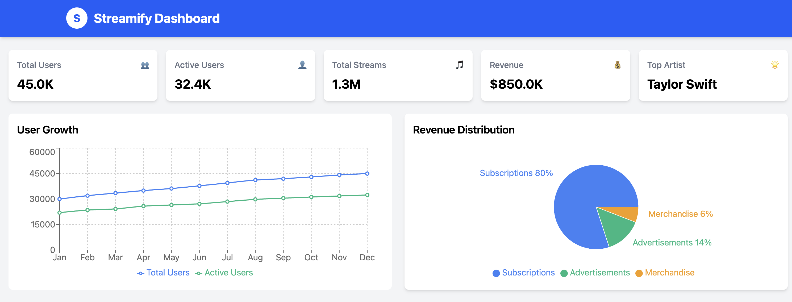
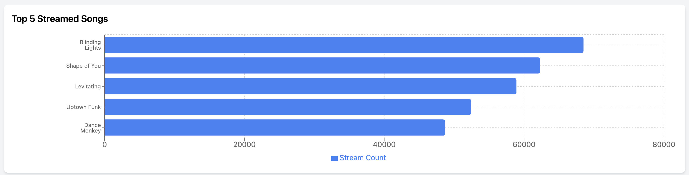
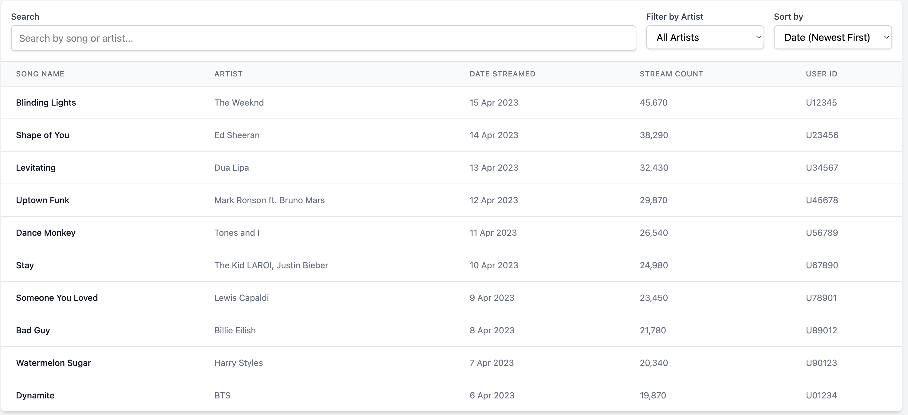

# 🎵 Streamify Dashboard

A modern **music streaming analytics dashboard** built with **React, Tailwind CSS, and Recharts**. It provides insights into music streaming data, including user growth, revenue distribution, and top streamed songs.**This V0 all the datas are just mock data**

## 🚀 Features

✅ **Metrics Overview** – Displays key performance indicators (KPIs)  
✅ **Interactive Charts** – Line, bar, and pie charts for data visualization  
✅ **Search & Filtering** – Easily find songs and filter by artist  
✅ **Sorting** – Sort stream data by date and popularity  
✅ **Responsive UI** – Fully optimized for mobile and desktop  
✅ **Local State Persistence** – Saves user preferences with localStorage  
✅ **Performance Optimizations** – useMemo and React.memo to minimize re-renders  

## 🖥️ Tech Stack

- **Frontend:** React, Tailwind CSS, Recharts
- **State Management:** useState, useEffect, useMemo
- **Performance Optimizations:** React.memo, useMemo
- **Data Handling:** Mock JSON data
- **Deployment:** GitHub Pages / Vercel / Netlify

## 📸 Screenshots







## 📦 Installation & Setup

1️⃣ Clone the repository
```sh
git clone https://github.com/your-username/streamify-dashboard.git
cd streamify-dashboard

2️⃣ Install dependencies
npm install

3️⃣ Start the development server
npm run build

4️⃣ Build for production
npm run build


